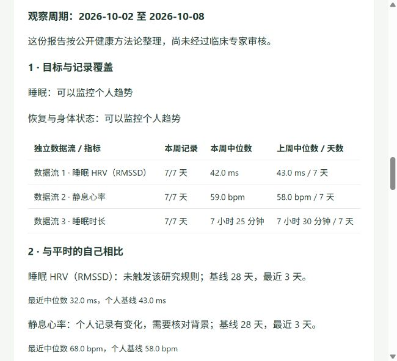

# HealthOS Open：让已有手环的数据变成看得懂的健康报告

**第一次来？不用安装、不用提供密钥。先了解你已有的设备怎么接，把数据交给自己的 Agent 后能得到什么。**

[从这里开始](docs/start-here.md) · [直接阅读完整报告](docs/sample-health-report.md) · [无需安装的交互演示](docs/public-demo.md) · [按型号查字段](docs/model-capabilities.md) · [核对方法与论文](docs/report-methodology.md)

## 这个 GitHub 给你什么

| 你想知道 | 直接打开 |
| --- | --- |
| 我的 Fitbit、Apple Watch、WHOOP 或国内手环能接吗？ | [型号、读取字段与适配缺口](docs/model-capabilities.md) |
| 数据怎样合法交给自己的 Agent？ | [新用户路径](docs/start-here.md) · [Fitbit / Google 接入指引](docs/google-health-connect.md) |
| 它怎样结合健康方法论与个人诉求？ | [输入 → 方法 → 证据 → 行动 → 反馈](docs/report-methodology.md) |
| 我到底会收到怎样的报告？ | [完整合成报告](docs/sample-health-report.md) · [交互体验说明](docs/public-demo.md) |
| 怎么换成自己的 LLM、数据源和推送渠道？ | [插件协议](docs/plugins.md) · [Agent 交接说明](docs/agent-handoff.md) |
| 看懂后，怎么真正用自己的数据运行？ | [个人部署与配置](docs/install.md) |

## 以 Fitbit Air 用户为例

你关注睡眠与恢复，但看不懂 App 的数字。先按[指引](docs/google-health-connect.md)确认数据访问资格：没有 Google API 项目资格时，从官方导出开始；已获资格时，可试实验性只读接口。HealthOS 当前 API 读取日静息心率、日均 RMSSD、已处理主睡眠，导出还可读取步数子集。

随后确认目标、生活背景和每个字段的用途。系统检查记录与缺失，分设备和算法比较自己的基线，生成有证据链接的报告。自己的 LLM 可补充解释；周期推送和模型分享分别授权。记录是否执行、是否适合和自述感受，系统据此更新可查看、可清除的档案。

**截至 2026-10-09，Google 暂停新项目接入；创建 OAuth 客户端不等于取得资格。** [官方状态](https://developers.google.com/health)。真实 Fitbit Air 账号接入仍未验证。

## 报告长什么样

[阅读完整报告](docs/sample-health-report.md)：目标与数据覆盖、本周与上周、个人趋势、背景问题、下周行动、反馈记忆、证据与未知。数字全部为合成数据，图片在 GitHub 就能看到。

[交互演示](docs/public-demo.md)提供单个 HTML，可下载后直接用浏览器打开，切换设备、目标和记录覆盖，体验反馈如何暂停不适合的行动。当前 GitHub Pages 需管理员首次启用；尚未将未部署的网页地址作为在线入口。

## 当前能用到什么程度

这是 v0.6 开发者原型：有导出读取器、实验性 Google API、中文个人操作界面、定期 Markdown/JSON 报告、可替换模型和可选飞书渠道。20 行设备目录是调研范围，不能当作 20 款已验证集成。

专业结构不等于医生出具报告：公开论文与指南可以追溯，但软件效果、基线参数和真实设备兼容性尚未临床验证。模型不能代替确定性统计；反馈不证明干预效果。详见[方法论](docs/report-methodology.md)和[安全说明](SECURITY.md)。

GitHub 展示说明、源码和合成示例，不运行你的私人监控。真实健康记录、模型密钥和授权凭证应放在自己的私人部署环境。看懂后再进入[安装说明](docs/install.md)；本机监听地址只用于部署后的个人操作。
