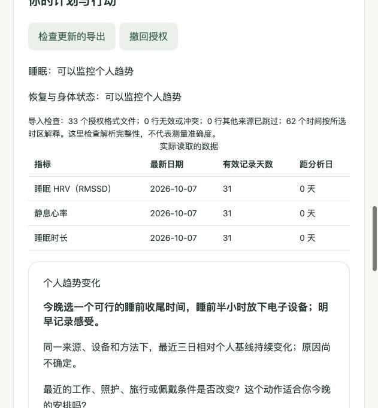

# HealthOS Open

**从需求出发，把用户自愿开放的设备数据变成可解释、可反馈的主动健康行动。** v0.5 开发版，以 Fitbit 官方导出为完整示例；本地网页和终端都可使用。

[English](README.md) · [Fitbit 接入](docs/fitbit-onboarding.md) · [飞书与闭环](docs/personalized-care.md) · [插件接口](docs/plugins.md) · [输出结构](docs/structured-advice.md)

```text
描述需求 → AI/本地引导提出目标 → 用户确认
  → 选择已有设备 → 逐项授权指标与用途
  → 检查真实数据覆盖 → 独立设备基线 / 目标行动
  → 结构化建议 → 本地 / 飞书推送 → 执行与感受反馈 → 下一轮重算
```

## 第一次使用

需要 Python 3.10+，推荐 3.12。macOS/Linux 运行时无第三方依赖；Windows 安装时补充时区数据库；Windows 用户可用 `py -3.12` 替代 `python3.12`，并用 `.venv\Scripts\Activate.ps1` 激活环境。

```bash
git clone https://github.com/producer1218-code/healthos-open.git
cd healthos-open
python3.12 -m venv .venv
source .venv/bin/activate
python -m pip install -e .
healthos serve
```

打开终端显示的 `http://127.0.0.1:8765`。说出“我想改善睡眠，了解运动恢复”，确认目标、回答可跳过的问题，再选择 Fitbit 导出 ZIP 或解压目录。指标与三个用途分别自愿授权，默认全部关闭。没有文件也可以先建立计划。

Google 账号从 [Google Takeout](https://takeout.google.com) 选择 **Google Health**。原 Fitbit 登录使用账号的 Data Export → Request Data。具体步骤见[官方导出说明](https://support.google.com/googlehealth/answer/14236615)。无需注册开发者账号，也无需给 HealthOS Fitbit 密码。

已有导出中，当前读取 **睡眠时长、静息心率、明确方法的 RMSSD HRV、步数**。格式、来源和型号不能保证人人一致，支持范围见[Fitbit 格式说明](docs/fitbit-onboarding.md)。绑定一台声明的设备；多台设备需要各自独立的数据入口，导出无法区分时不能把整包重新命名当成另一台设备。

## 没有设备文件？先体验合成示例

```bash
python examples/create_fitbit_demo.py
healthos serve --workspace data/private/synthetic-person
```

在页面选择生成的 `data/private/synthetic-fitbit.zip`，描述睡眠/恢复目标，选择指标和授权。示例生成最近 31 天的虚构记录，可以看到个人趋势建议、每周预算、执行/感受按钮和 JSON 下载。**合成授权与记录不是实际用户同意或健康证据。**



终端偏好者运行 `healthos start`。录入时会解释字段与导出步骤，错误编号、时区和路径可以重新填写。

## 怎样主动推送

`serve` 持续运行，每 60 分钟检查已有档案和导出；终端可以运行 `healthos watch`，或 `healthos watch --once` 只检查一轮。两者使用同一私有工作目录。默认成功投递到本地 JSON；要在 iPhone 接收，配置飞书机器人并开放**摘要外发**：

```bash
healthos serve --delivery-settings data/private/feishu_delivery.json --allow-external-delivery
```

飞书应用、密钥环境变量、本人接收 ID 与权限的完整步骤见[推送配置](docs/personalized-care.md#飞书设置)。飞书消息是文本，当前反馈在电脑本地页面完成；手机卡片回调尚未实现。不要同时运行两个不同投递渠道，除非你明确理解同一队列的送达语义。

**官方导出是快照。** 保持服务运行不会自动产生新数据，持续监控需要更新你选中的文件/目录。ZIP 上传保存成私有副本；更新后需要重新选择，或者改用会更新的本地目录。实时 OAuth 同步可通过独立适配器扩展，当前没有自动登录厂商账号。

## 建议为什么给我

- **个人趋势变化**：同一来源、设备、方法下，最近 3 天与前 28 天个人基线比较；至少 14 个有效基线日。窗口和门槛是未经临床验证的工程假设。
- **目标行动**：用户确认目标、允许提醒且有近期相关记录时，可在校准期提供指南支持的一般行动，明确标注“不是异常发现”。没有有效数据或数据过旧不会推送。
- **可闭环**：执行和感受分开记录；“不适合我”或“感觉更差”暂停相同行动。每轮按目标、授权、覆盖和反馈重算。点击、执行和健康改善是不同事情。
- **有节制**：默认成功推送最多 2 条 / 7 天，同一流冷却 7 天；候选不花预算，重跑不会重复送达，撤回取消未送建议。模糊网络结果暂停自动重试，等待对账。

结构化输出包括目标状态、数据覆盖、来源、触发类型、观察、行动、证据支持范围、内容版本、审核状态和反馈选项。详见[输出契约](docs/structured-advice.md)。

## AI 与可插拔

默认是**本地关键词引导，明确标注不是 AI**。可配置兼容模型理解用户自述、提出目标和追问，用户在页面逐次勾选后才发送这段自述。模型不接收设备原始记录，也不能代替用户授权、修改趋势阈值或生成治疗决策。示例配置见 `examples/intent_settings.json`。密钥仅使用环境变量。

数据适配器、需求理解器、建议插件、投递插件都有独立接口。可在高级档案中添加多个来源并分别授权；页面的“添加另一个设备/入口”可保留现有来源，计划中可单独移除入口。自定义插件是可信 Python 代码，运行前须审查。详见[插件指南](docs/plugins.md)。

## 当前范围与验证

本地单用户工具，58 项合成测试覆盖核心行为；持续集成会运行完整测试。浏览器人工验证了描述、目标调整、导入、建议和执行反馈。飞书与 AI 网络调用使用模拟测试，未宣称完成真实账号送达或模型质量评估。

代码依据公开原始来源整理一般健康行动，**尚未经过实际临床专家审核**，也没有验证能改善健康。它不提供诊断、治疗或急症监控。Apple XML 只解析部分数量记录，当前不解析 Apple 睡眠；20 个型号/平台研究目录不代表都已接入。语音、录音设备、效率场景、账户服务和 iPhone 原生界面留作后续独立插件。

真实导出、档案、上传、密钥、SQLite 和送达记录应保存在 `data/private/`，已默认忽略。撤回不是删除：原始文件和已送出的副本仍保留。工作目录没有应用层加密。仓库只包含合成示例。

```bash
python -m unittest discover -s tests -v
```

[方法与证据](docs/evidence-to-code.md) · [模型研究目录](docs/model-capabilities.md) · [安全](SECURITY.md) · [贡献](CONTRIBUTING.md) · MIT
