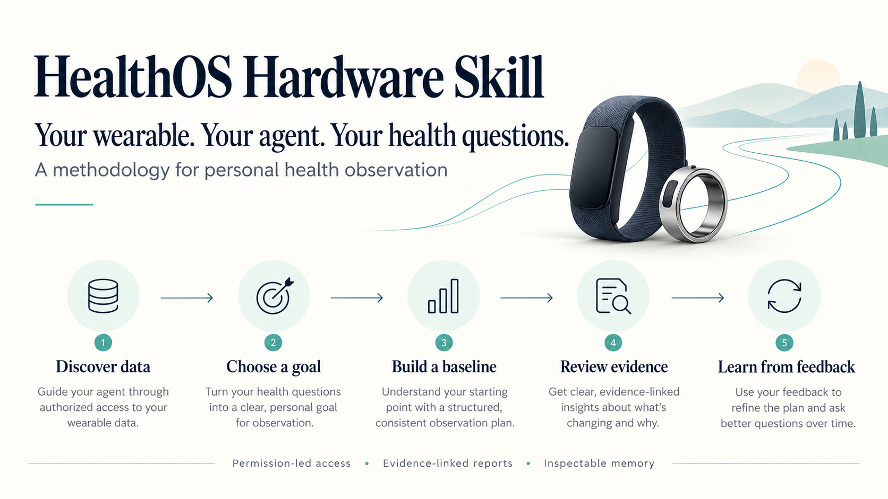

# HealthOS Hardware Skill

**你的设备，你的 Agent，你关心的健康问题。**

一套给已有 Agent 使用的个人健康观察方法论：让它识别你已有硬件的数据入口，询问你关心什么，再把允许使用的记录转化为观察方案、证据可追溯的报告和可复盘行动。

**你已经会用 Agent，也有手环？把 [START_HERE.md](START_HERE.md) 交给它。** 第一轮从设备型号和健康问题开始，无需先安装、填额外 LLM key 或观看演示。

[Agent Skill](skills/healthos/SKILL.md) · [完整方法论](docs/observation-method.md) · [实际适配字段](docs/start-here.md) · [方法与论文](docs/report-methodology.md) · [English](README.md)

## 一个陌生人可以如何开始

例如你说：“我有手环，但最近总觉得累，看 App 也看不懂。”Agent 先了解你关心睡眠、白天精力还是训练恢复，询问必要背景，核实设备数据能否开放，再与你讨论观察什么。它不会直接把疲劳归因于 HRV。

| 阶段 | Agent 按方法论做什么 | 你得到什么 |
| --- | --- | --- |
| 发现数据 | 识别型号、手机平台、官方入口与访问资格 | 原来设备数据可以怎样交给自己的 Agent |
| 确认诉求 | 询问具体问题、时间与必要背景，沿用已有回答 | 能被现有数据部分回答的个人目标 |
| 制定计划 | 明确指标、权限、质量检查、证据与复盘周期 | 一份可检查、可修改的观察方案 |
| 持续观察 | 在授权与执行条件具备后积累记录，分流比较个人基线 | 了解自己的变化与数据缺口 |
| 报告解释 | 区分事实、可能解释、未知与可行动项 | 看得懂且能追溯依据的报告 |
| 反馈迭代 | 分别记录执行、适合程度与自述感受 | 可查看、纠正、删除的授权记忆 |

[Agent 观察协议](skills/healthos/references/observation-method.md)规定问题怎样映射到数据、何时补问背景、怎样选择可行行动与保留未知。[观察计划 JSON 模板](skills/healthos/references/observation-plan-v1.json)用于交接提案，当前不能自动导入运行时，也不能代替用户授权。

## 方法论与可插拔执行组件

方法论可以先在已有 Agent 中使用；真实接入和周期运行需要相应组件。使用已有 Agent 不需要再给 HealthOS 一个模型 key，只有运行时要独立调用模型时才配置。

| 组件 | 可替换内容 | 当前入口 |
| --- | --- | --- |
| 数据 | 官方 API、手机健康平台、导出、受信适配器 | [实际字段](docs/start-here.md)、[型号目录](docs/model-capabilities.md) |
| 计算 | 质量、缺失、来源与方法隔离、个人基线 | [报告方法](docs/report-methodology.md) |
| 解释 | 已有 Agent，或可选独立 LLM | [Agent 交接](docs/agent-handoff.md) |
| 记忆与推送 | 私人存储、调度、投递渠道 | [插件协议](docs/plugins.md)、[个人部署](docs/install.md) |

当前 v0.6 原型支持 Fitbit 官方导出、符合资格的实验性 Google API／保存 JSON、Apple Health XML 和 WHOOP 保存 JSON 子集，以及标准 CSV/JSONL。20 行设备目录是调研覆盖，不是 20 个已验证连接器。Google 暂停新项目接入，最近核实 2026-10-09；实际操作前再次核对[官方状态](https://developers.google.com/health/about)。

论文与指南支持测量纪律、背景访谈和一般健康行动；个人基线阈值是工程假设，没有临床专家签字或健康效果验证。[论文到代码](docs/evidence-to-code.md) · [安全与隐私](SECURITY.md)。

## 按需要查看示例与运行

[完整合成报告](docs/sample-health-report.md)展示输出结构；[可选首次执行](docs/agent-quickstart.md)可用生产分析器生成合成报告；[交互示例](docs/public-demo.md)只展示固定示例。README 的产品主张图是方法流程展示，不是真人健康结果或已运行服务。

阅读仓库不会自动连接账号、保存私人记忆或启动持续监控。决定使用哪些数据、放在哪里处理之后，再进入[个人部署](docs/install.md)。公开仓库不保存真人记录和凭证。GitHub Pages 上线尚未验证。

公开仓库名为 HealthOS-Hardware-Skill，Python 包仍为 healthos-open。面向检索与 Agent 的入口是 [llms.txt](llms.txt)、[AI_CONTEXT.md](AI_CONTEXT.md) 与 [能力清单](healthos-skill.json)。它们帮助读者判断用途，不保证 Agent 路过、搜索排序或自动激活。
